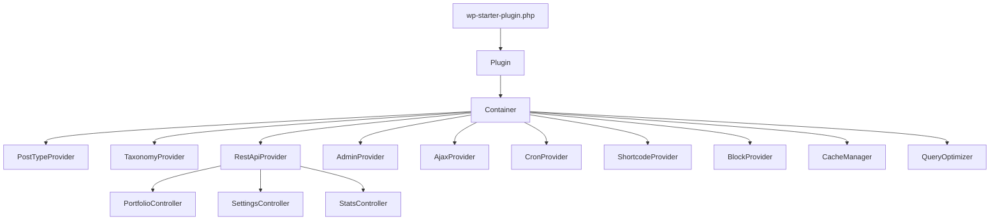

# WP Starter Plugin

WordPress Starter Plugin — Modern PHP 8.5 + PSR-4 DI, comprehensive WP API coverage


---

## Architecture Diagram



---

## Quick Start

### Option A — LocalWP (recommended)

1. Create a new site in [LocalWP](https://localwp.com/).
2. Symlink or copy this directory into the site's `wp-content/plugins/` folder:

   ```bash
   ln -s /path/to/wp-starter-plugin \
     ~/Local\ Sites/<site>/app/public/wp-content/plugins/wp-starter-plugin
   ```

3. Install Composer dependencies:

   ```bash
   cd /path/to/wp-starter-plugin
   composer install
   ```

4. Activate the plugin via WP Admin or WP-CLI:

   ```bash
   wp plugin activate wp-starter-plugin
   ```

### Option B — Docker

```bash
# Start a WordPress + MySQL environment
docker compose up -d

# Install plugin dependencies
docker compose exec wordpress bash -c "cd /var/www/html/wp-content/plugins/wp-starter-plugin && composer install"

# Activate
docker compose exec wordpress wp plugin activate wp-starter-plugin --allow-root
```

---

## Tech Stack

| Layer | Technology |
|---|---|
| Language | PHP 8.5 (strict types, readonly classes, named arguments, first-class callables) |
| Dependency Injection | Custom PSR-11 container with reflection auto-wiring |
| Testing | PHPUnit 11 + Brain Monkey (WP function stubs) |
| Static Analysis | PHPStan level 8 + WordPress stubs |
| Coding Standards | PHPCS WordPress-Extra |
| WP API Coverage | CPTs, Taxonomies, REST API, Gutenberg Blocks, WP-CLI, Settings API, AJAX, Cron, Shortcodes, Widgets, Meta API |

---

## WordPress APIs Demonstrated

| API | Files |
|---|---|
| Custom Post Types | `src/PostTypes/Portfolio.php`, `Testimonial.php`, `FAQ.php` |
| Custom Taxonomies | `src/Providers/TaxonomyProvider.php` |
| REST API (full CRUD) | `src/Rest/PortfolioController.php`, `AbstractController.php` |
| Gutenberg Blocks | `src/Providers/BlockProvider.php` |
| Settings API | `src/Providers/AdminProvider.php`, `src/Models/Settings.php` |
| AJAX Handlers | `src/Providers/AjaxProvider.php` |
| WP Cron | `src/Providers/CronProvider.php` |
| Shortcodes | `src/Providers/ShortcodeProvider.php` |
| Widgets | `src/Providers/WidgetProvider.php` |
| WP-CLI Commands | `src/CLI/SeedCommand.php`, `CacheCommand.php` |
| Meta API + Traits | `src/Traits/HasMeta.php` |
| Query Optimization | `src/Services/QueryOptimizer.php` |
| Transient Caching | `src/Services/CacheManager.php` |
| Content Filters | `src/Hooks/ContentFilters.php` |
| Rewrite Rules | `src/Hooks/RewriteRules.php` |
| Image Sizes | `src/Services/ImageService.php` |
| CSV/JSON Export | `src/Services/ExportService.php` |
| HTML Email | `src/Services/EmailService.php` |

---

## Project Structure

```
wp-starter-plugin/
├── wp-starter-plugin.php       # Plugin entry point + header
├── uninstall.php               # Cleanup on uninstall
├── composer.json
├── phpcs.xml
├── phpstan.neon
├── phpunit.xml.dist
├── src/
│   ├── Plugin.php              # Bootstrap: container + providers
│   ├── Container.php           # PSR-11 DI container
│   ├── NotFoundException.php
│   ├── CLI/
│   │   ├── SeedCommand.php
│   │   └── CacheCommand.php
│   ├── Hooks/
│   │   ├── ContentFilters.php
│   │   ├── QueryModifiers.php
│   │   └── RewriteRules.php
│   ├── Models/
│   │   ├── Portfolio.php
│   │   └── Settings.php
│   ├── PostTypes/
│   │   ├── Portfolio.php
│   │   ├── Testimonial.php
│   │   └── FAQ.php
│   ├── Providers/
│   │   ├── AdminProvider.php
│   │   ├── AjaxProvider.php
│   │   ├── BlockProvider.php
│   │   ├── CronProvider.php
│   │   ├── PostTypeProvider.php
│   │   ├── RestApiProvider.php
│   │   ├── ShortcodeProvider.php
│   │   ├── TaxonomyProvider.php
│   │   └── WidgetProvider.php
│   ├── Rest/
│   │   ├── AbstractController.php
│   │   └── PortfolioController.php
│   ├── Services/
│   │   ├── CacheManager.php
│   │   ├── EmailService.php
│   │   ├── ExportService.php
│   │   ├── ImageService.php
│   │   └── QueryOptimizer.php
│   └── Traits/
│       ├── HasHooks.php
│       └── HasMeta.php
├── tests/
│   ├── bootstrap.php
│   └── Unit/
│       ├── ContainerTest.php
│       └── Models/
│           └── SettingsTest.php
└── docs/
    ├── ARCHITECTURE.md
    ├── CLI-COMMANDS.md
    ├── HOOKS-REFERENCE.md
    ├── REST-API.md
    └── TESTING.md
```

---

## Testing

```bash
# Install dependencies
composer install

# Run all unit tests
composer test

# Coding standards check
composer phpcs

# Static analysis (PHPStan level 8)
composer phpstan
```

See [docs/TESTING.md](docs/TESTING.md) for full details on test structure and Brain Monkey usage.

---

## WP-CLI Commands

```bash
# Seed 20 portfolio items
wp starter seed --count=20

# Flush plugin transients
wp starter cache flush

# Show active transient count
wp starter cache stats
```

See [docs/CLI-COMMANDS.md](docs/CLI-COMMANDS.md) for full reference.

---

## REST API

Base URL: `/wp-json/wp-starter/v1`

```bash
# List portfolio items
curl https://example.com/wp-json/wp-starter/v1/portfolio

# Get single item
curl https://example.com/wp-json/wp-starter/v1/portfolio/42

# Create item (authenticated)
curl -X POST https://example.com/wp-json/wp-starter/v1/portfolio \
  -H "Content-Type: application/json" \
  -H "X-WP-Nonce: <nonce>" \
  -d '{"title":"My Project"}'
```

See [docs/REST-API.md](docs/REST-API.md) for the full endpoint reference.

---

## Further Reading

- [Architecture](docs/ARCHITECTURE.md) — DI container, providers, CPTs, REST, Blocks
- [Testing](docs/TESTING.md) — PHPUnit, Brain Monkey, PHPStan, PHPCS
- [Hooks Reference](docs/HOOKS-REFERENCE.md) — all actions and filters
- [REST API](docs/REST-API.md) — endpoints with curl examples
- [CLI Commands](docs/CLI-COMMANDS.md) — WP-CLI reference

---

## License

MIT. See [LICENSE](LICENSE) or the `"license": "MIT"` field in `composer.json`.
